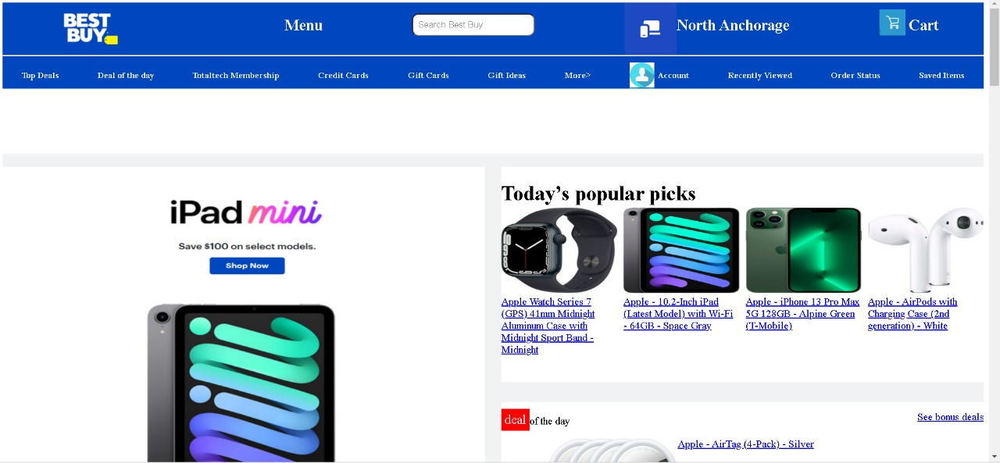

# bestbuy-clone
Best Buy Co. Inc. is an American multinational consumer electronics retailer headquartered in Richfield, Minnesota. Originally founded by Richard M. Schulze and James Wheeler in 1966 as an audio specialty store called Sound of Music, it was rebranded under its current name with an emphasis on consumer electronics in 1983.

## Home Page

  

## Home Page Best Deal's

  

## 

  

## Footer

  

